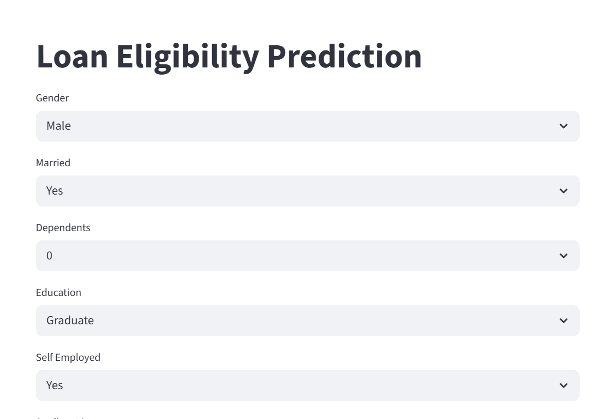
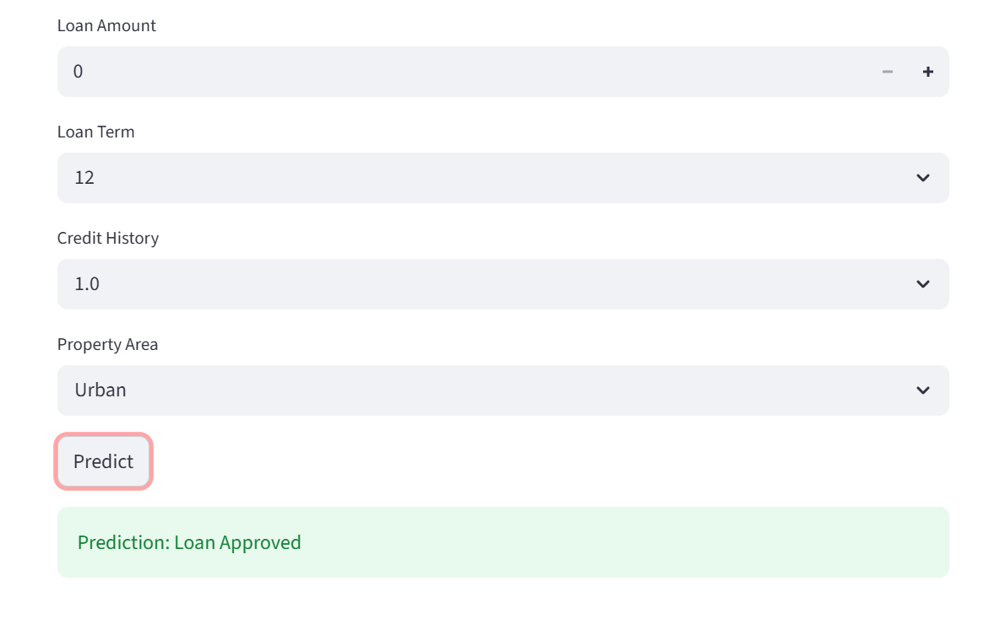

# 🏦 Loan Eligibility Prediction App

A machine learning-based web application that predicts whether a loan application will be approved based on user inputs like income, credit history, and loan details.

---

## 🚀 Demo

🔗 **Live App:** (Add after deployment)  
🔗 **GitHub Repo:** ([your repo link]https://github.com/sivamani-muraboyina/LoanEligibilityPrediction)

---

## 📌 Overview

This project uses a **K-Nearest Neighbors (KNN)** model to predict loan approval status.  
It provides a simple and interactive **Streamlit UI** where users can input details and get instant predictions.

---

## 🎯 Problem Statement

Loan approval is a critical process in financial institutions.  
This project aims to automate decision-making using machine learning to:

- Reduce manual effort  
- Improve consistency  
- Provide quick predictions  

---

## 🧠 Machine Learning Pipeline

- Data Cleaning & Preprocessing  
- Feature Encoding (Categorical → Numerical)  
- Feature Scaling (StandardScaler)  
- Model Training (KNN Classifier)  
- Model Evaluation  
- Model Saving (.pkl files)

---

## 📊 Model Performance


- Accuracy: 81%  
- Precision: 81%  
- Recall: 81%  
- F1 Score: 81%  

---

## 💻 Application UI

### 🔹 Input Features
- Loan Amount  
- Loan Term  
- Credit History  
- Property Area  

### 🔹 Output
- Loan Approved ✅  
- Loan Not Approved ❌  

---

## 📸 Screenshots

### 🏠 Home Page


### ✅ Prediction Result


---

## 🛠️ Tech Stack

- **Python**
- **Pandas, NumPy** – Data Processing  
- **Scikit-learn** – Model Building (KNN)  
- **Streamlit** – Frontend UI  
- **Joblib** – Model Persistence  
- **Docker** – Containerization  

---

## 📦 Project Structure
```bash
LoanEligibilityPrediction/
│
|___api_app.py
|
├── app.py # Streamlit app
├── requirements.txt
├── Dockerfile
│
├── models/
│ ├── loan_model.pkl
│ ├── scaler.pkl
│ ├── encoder.pkl
│
├── src/
│ ├── predict.py
│ ├── preprocess.py
│
├── notebooks/
│ └── model_building.ipynb
│
├── assets/
│ ├── home.png
│ ├── prediction.png
```


---

## ▶️ How to Run Locally

### 1. Clone repo
```bash
git clone <https://github.com/sivamani-muraboyina/LoanEligibilityPrediction>
cd LoanEligibilityPrediction
```

### 2.Create your own environment
```bash
python -m venv venv
venv\Scripts\activate
```

### 3. Install Dependencies
```bash
pip install -r requirements.txt
```

### 4.Run app
```bash
streamlit run app.py
```

## DockerSupport
### 5.Build Image
```bash
docker build -t loan-app .
```

### 6.Run Container
``` bash
docker run -p 8501:8501 loan-app
```

## Deployment 

### Deployment using hugging face Spaces


# Author 

# Sivamani Muraboyina


